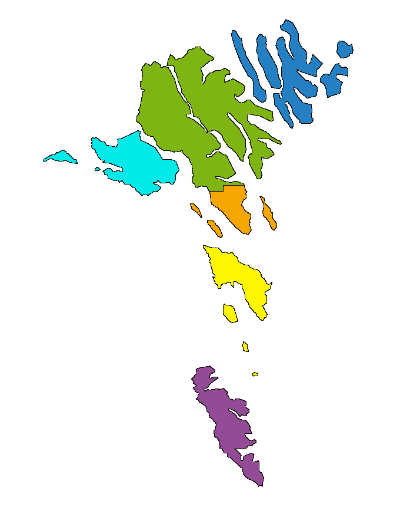

```{r eval=FALSE}
install.packages('ggplot2')
install.packages('dplyr')
install.packages('magrittr')
install.packages('devtools')
install.packages('pheatmap')
install.packages("BiocManager")
BiocManager::install("FamAgg")
```

```{r message=FALSE}
library(ribd)
library(kinship2)
library(ggplot2)
library(dplyr)
library(magrittr)
library(stringr)
library(readr)
library(tibble)
library(tidyr)
library(pheatmap)
library(scales)
library(FamAgg)
```

We will use the Genealogy Registry of the Genetic Biobank of the Faroe Islands to select a representative group of individuals from the FarGen cohort. It should be representative in the sense that they should be as distantly related as possible, to capture as much genetic variation as possible. We will mitigate geographical stratification as well, as there is some geographic bias in the FarGen cohort.

# Read pedigree

Read a CSV with the pedigree of the FarGen cohort. We will not be using the `birth_place` and `birth_year` columns, so we discard these. We also rename the columns so that they match those used in the `kinship2` package, and recode the sex indicators for the same reason.

```{r}
ped_path = '/home/olavur/experiments/2020-06-16_wgs_selection/data/trees/fargen.csv'
df = read.csv(ped_path, fileEncoding = "ISO-8859-1")
# Discard unused columns.
df = df %>% select(-c(birth_place, birth_year))
# Rename columns to be consistent with the ones used in kinship2.
df = df %>% rename(id=ind, dadid=father, momid=mother)
# Recode the sex indicators to match that in kinship2.
df = df %>% mutate(sex = if_else(sex == 'M', 1, 2))
```

The `fixParents` function from the `kinship2` package adds missing parents to the pedigree, and if sex does not match parental status (i.e. mother should be female) this is fixed.

```{r}
df_fixed = with(df, fixParents(id, dadid, momid, sex))
```

```{r}
writeLines(sprintf('%d individuals added to pedigree.', nrow(df_fixed) - nrow(df)))
```

Luckily, sex and parental status matched in all cases, as we can see below.

```{r}
df_fixed_orig_inds = df_fixed %>% filter(id %in% df$id)
sex_diff = sum(df$sex != df_fixed_orig_inds$sex)
writeLines(sprintf('Sex corrected for %d individuals.', sex_diff))
```

Construct a `kinship2` pedigree object.

```{r}
ped_obj = with(df_fixed, kinship2::pedigree(id, dadid, momid, sex))
ped_obj
```

# Get IDs of FarGen participants

Get the IDs of the FarGen participants.

```{r}
# This CSV file has FarGen number (FN) IDs and IDs from AEBS (RIN).
fargen_ids_path = '/home/olavur/experiments/2020-06-16_wgs_selection/data/ids/fargen_rin_samplename.csv'
fargen_ids_df = read.csv(fargen_ids_path)

# Get just the RIN in a vector, as characters.
fargen_rin = as.character(fargen_ids_df$rin)

writeLines(sprintf('Working with %d FarGen participants.', length(fargen_rin)))

# If there are duplicate RIN, this test will fail.
tt = assertthat::assert_that(length(fargen_rin) == length(unique(fargen_rin)), msg='Error: non-unique IDs in FarGen participant list.')
```

Check that all individuals can be found in pedigree.

```{r}
# RIN IDs from pedigree.
ped_ids = as.character(ped_obj$id)
# If any of the FarGen individuals cannot be found in the pedigree, this test will fail.
tt = assertthat::assert_that(sum(!(fargen_rin %in% ped_ids)) == 0, msg='Error: some FarGen participant IDs were not found in pedigree.')
```

# Minimum lineage depth filtering

We are going to exclude all individuals that have a minimum lineage depth under 2. With other words, we will exclude individuals whose grandparents are not recorded in the Genealogy Registry.

We will use the `FamAgg` Bioconductor package for this purpose, so we will start by preparing a `FAData` pedigree object.

```{r}
# Convert kinship2 pedigree object to dataframe.
ped_df = as.data.frame(ped_obj)

# Add placeholder family ID.
ped_df = ped_df %>% mutate(family=rep(1, nrow(ped_df)))

# Construct FamAgg pedigree object.
fad = FAData(pedigree=ped_df, family.col='family', father.col='dadid', mother.col='momid', sex.col='sex')
```

To check whether an individual has minimum depth of at least 2, I will count the total number of ancestors two generations back. If the total number of ancestors within 2 generations is less than 6, one or more grandparent (and perhaps parents) are missing. This is exemplified below. The individual's ID is highlighted in RED, and their ancestors are marked by an asterisk (`*`). Note that the total number of ancestors for this individual is 4, since two grandparents is missing, so we will exlcude this individual from further analysis. Note that I've also psuedo-anonymized the IDs in the plot.

```{r}
# ID of individual to check.
proband_id = '740605'

# Make a pedigree of depth 2 for the individual.
small_ped = buildPed(fad, id=proband_id, max.generations.up=2)

# Anonymize the IDs.
new_ids = 1:nrow(small_ped)
names(new_ids) = small_ped$id  # Named vector, old ID to new ID mapping.
new_father = new_ids[as.character(small_ped$father)]  # New father IDs.
new_mother = new_ids[as.character(small_ped$mother)]  # New mother IDs.
# Make a new pedigree dataframe with the new IDs.
small_ped_anon = small_ped %>% mutate(family=family, id=new_ids, father=new_father, mother=new_mother)
# Make this pedigree into a FAData object.
small_fad_anon = FAData(small_ped_anon)

# Get the anonymized ID of the proband.
new_proband_id = new_ids[proband_id]

# Count number of ancestors up to 2 generations back.
anc = getAncestors(small_fad_anon, new_proband_id, max.generations=2)

# Highlight both the individual and the ancestors.
plotPed(small_fad_anon, id=new_ids, highlight.ids=anc, proband.id=new_proband_id)
```

For every FarGen participant, I shall calculate the number of ancestors up to 2 generations back. I also show a table, showing the frequency of each count value. We see that most of the individuals have four grandparents registered in the Genealogy Registry, which is good.

```{r}
# Make a function to calculate the number of ancestors.
count_ancestors = function(id, obj=fad, max_gen=2) {
    # Get the ancestors up to `max_gen` generations back.
    anc = getAncestors(obj, id, max.generations=max_gen)
    # Return the number of ancestors.
    return(length(anc))
}

# Count the number of ancestors for each individual.
anc_count = sapply(fargen_rin, count_ancestors)
# Make a table of ancestor counts.
table(anc_count)
```

Below we filter out all FarGen participants with missing grandparents in the genealogy. We shall continue with this set of individuals. We will from time to time refer to this continually evolving set of individuals as **probands**.

```{r}
min_anc = 6
probands_mindepth = fargen_rin[anc_count == min_anc]
```


# Geographical stratification of FarGen cohort

Get the region identifiers. This CSV contains the region identifiers (1-6) for all individuals in the genealogy registry. These region identifiers tells us which part of the Faroe Islands each individual was born in.

```{r}
# Read the CSV.
regions_path = '/home/olavur/experiments/2020-06-16_wgs_selection/data/placenames/rin_region.csv'
regions_df = read.csv(regions_path)

# Create a named vector, instead of using the dataframe.
regions_all = regions_df$region
names(regions_all) = regions_df$ind

# Print some simple statistics.

# Number of individuals in AEBS.
n_total = length(regions_all)

# Count the number of missing values, and get the fraction.
n_na = sum(is.na(regions_all))
writeLines(sprintf('Proportion of NA: %.4f', n_na / n_total))

# Number of individuals in AEBS with defined region.
n_nonmissing = length(regions_all[!is.na(regions_all)])

# Proportions for each region, ignoring missing values.
writeLines('Proportion of each region:')
region_prop_all = table(regions_all) / n_nonmissing
print(region_prop_all)
```

Obtain a list of region identifiers for the probands. Remove any individuals with missing region identifier.

```{r}
# Region identifiers for the probands.
regions_fargen = regions_all[probands_mindepth]

# Remove missing.
probands_nonmissing = probands_mindepth[!is.na(regions_fargen)]
regions_nonmissing = regions_fargen[!is.na(regions_fargen)]

# Print some simple statistics.

writeLines(sprintf('Number of probands with defined (non-missing) region: %d', length(probands_nonmissing)))

writeLines('Proportion of each region:')
table(regions_nonmissing) / length(regions_nonmissing)
```

The proportions of individuals in each region is printed above for both the entire genealogy registry and for the FarGen cohort. As we can see, region number 3, which is the capital region, is substantially over-represented.

The map below shows the Faroe Islands and where the six regions each have their own color. The table below the image shows the region number ID, the name of the region and the corresponding color on the map.



Region number | Region name(s) | Color
-----|-----|----
1 | Norðoyggjar | <span style="color:#157EBF">Blue #157EBF</span>
2 | Eysturoy og Norðstreymoy | <span style="color:#78B430">Green #78B430</span>
3 | Suðurstreymoy | <span style="color:#FAA530">Orange #FAA530</span>
4 | Vágar og Mykines | <span style="color:#00E9E8">Teal #00E9E8</span>
5 | Sandoy, Skúvoy, Stóra Dímun | <span style="color:#FFF73F">Yellow #FFF73F</span>
6 | Suðuroy | <span style="color:#974C93">Purple #974C93</span>

# Calculate pairwise kinship coefficients

We calculate the kinship for the entire pedigree using a method from the `kinship2` package. The algorithm is based on Lange 1997:

> K Lange, Mathematical and Statistical Methods for Genetic Analysis, Springer-Verlag, New York, 1997.

This takes about half a minute on the machine I ran this on, and used just above 4 GB of memory.

```{r eval=FALSE}
kc_mat = kinship2::kinship(ped_obj)
```

We are only going to use the kinship coefficients between the probands, so we discard everything else. After we clear up the memory the remaining data is only a couple of megabytes.

```{r eval=FALSE}
kc_mat = kc_mat[probands_nonmissing, probands_nonmissing]
gc()
```

We write the kinship matrix to a file, so we don't have to calculate this again.

```{r eval=FALSE}
# Path to write kinship matrix to.
kc_file <- "/home/olavur/experiments/2020-06-16_wgs_selection/data/wgs_selection/kinship/probands_kinship.csv"

# Convert to dataframe and write to CSV.
kc_df <- data.frame(kc_mat)
# Write only column names, no row names.
write.csv(kc_df, file=kc_file, row.names=FALSE)
```

We read the kinship matrix from file, and make sure the columns and rows have the correct names.

```{r}
# Path to write kinship matrix to.
kc_file <- "/home/olavur/experiments/2020-06-16_wgs_selection/data/wgs_selection/kinship/probands_kinship.csv"

kc_df = read.csv(kc_file)

kc_mat = kc_df %>%
    unlist() %>%
    matrix(nrow=length(probands_nonmissing))

# Overwrite column names and write row names.
colnames(kc_mat) = probands_nonmissing
rownames(kc_mat) = probands_nonmissing
```

Make sure that the column names in the kinship file match `probands_nonmissing`.

```{r}
# Column names from the dataframe read from CSV.
csv_colnames = names(kc_df)

# The column names start with an "X", and then the RIN follows. Remove this "X".
csv_ids = sapply(csv_colnames, function(x) str_sub(x, start=2))
names(csv_ids) = NULL  # csv_ids is a named vector. Remove the names.

# Sort both vectors.
csv_ids = sort(csv_ids)
probands_nonmissing_sorted = sort(probands_nonmissing)

# If the probands_nonmissing and csv_ids vectors don't match completely, this test will fail.
res = assertthat::assert_that(sum(csv_ids != probands_nonmissing_sorted) == 0, msg='Error: proband IDs don\'t match IDs in kinship matrix CSV.')
```


# Relatedness pruning

Before we do a principal component analysis, we want to remove highly related individuals. We do this because it is difficult to detect population structure using PCA when individuals are closely related.

We want to remove any relationships with kinship coefficient higher than $2^{-4}$, which corresponds to a first-cousin relationship. We want to do this in a way that keeps as many of the individuals as possible. We will use my [prune_related Python tool](https://github.com/ilegusavnid/prune_related) for this, which solves the *maximum independet set* problem.

Download "prune_related" project and install dependencies via `conda`.

```
git clone https://github.com/ilegusavnid/prune_related.git
conda env create -f prune_related/environment.yml
```

Activate `conda` virtual environment and run the `prune_related.py` script. We specify a kinship threshold of $0.0625$ and specify that the kinship file contains column names.

```
conda activate prune_related
python prune_related/prune_related.py \
    data/wgs_selection/kinship/fargen_non-missing_region.csv \
    0.0625 \
    data/wgs_selection/unrelated_00625_fargen_non-missing_region.txt \
    true
```

Below we read the list of individuals found by `prune_related`.

```{r}
unrelated_path = '/home/olavur/experiments/2020-06-16_wgs_selection/data/wgs_selection/unrelated_probands_00625.txt'
unrelated = read_lines(unrelated_path) %>% as.numeric()

# The list from "prune_related.py" is 0-indexed, so we convert it to 1-indexed.
unrelated = unrelated + 1
writeLines(sprintf('Relatedness pruning kept %d out of %d individuals.', length(unrelated), length(probands_nonmissing)))
```

Subset lists of individuals and regions and the kinship matrix.

```{r}
probands_unrelated = probands_nonmissing[unrelated]
regions_unrelated = regions_nonmissing[unrelated]
n_probands_unrelated = length(probands_unrelated)
kc_mat_unrelated = kc_mat[probands_unrelated, probands_unrelated]
writeLines(sprintf("Working on %d individuals.", n_probands_unrelated))
```

As a sanity check, let's see what the new highest kinship is, after relatedness pruning. After pruning, kinship should be less than $2^{-4} = 0.0625$.

```{r}
max_kc_before = max(kc_mat[lower.tri(kc_mat)])
max_kc_after = max(kc_mat_unrelated[lower.tri(kc_mat_unrelated)])
writeLines(sprintf('Pruning threshold: 0.0625\nMax kinship before pruning: %.4f\nMax kinship after pruning: %.4f', max_kc_before, max_kc_after))
```


## Relatedness pruning (greedy algorithm)

The `prune_related` method is not super fast, as the algorithm that approximates the maximum independent set has a worst-case time complexity of $O(\frac{n}{(\log n)^2})$. But if we want something faster, we can always use this greedy algorithm. The drawback with the greedy algorithm is that it removes more individuals than the maximum independent set method.

```{r}
greedy_prune_related = function(kc_thres, kc_mat) {
  n_probands = dim(kc_mat)[1]
  
  # A mask vector of which individuals to include.
  mask_related <- rep(TRUE, n_probands)
  
  # Keep track of indexes.
  idx_proband <- seq(1, n_probands)
  
  # Lower triangular matrix.
  kc_tri <- kc_mat
  kc_tri[upper.tri(kc_tri)] <- 0
  diag(kc_tri) <- 0
  
  # Check whether relationships above the specified degree exist.
  cond <- sum(kc_tri > kc_thres) > 0
  # While such relationships exist.
  while(cond) {
    # Count the number of "close" relationships per person.
    n_related <- colSums(kc_tri[mask_related, mask_related] > kc_thres)
    
    # Get the index of the individual with the highest number of these relationships.
    # Resolve redundancies randomly by picking the first one.
    idx <- idx_proband[mask_related][n_related == max(n_related)][1]
    
    # Exclude this proband.
    mask_related[idx] <- FALSE
    
    # Update condition.
    cond <- sum(kc_tri[mask_related, mask_related] > kc_thres) > 0
  }
  
  mask_related
}
```

# Population structure in the Fargen cohort

We do a principal component analysis of the kinship matrix of the unrelated individuals.

```{r}
# Compute the first two principal components.
kc_pc <- prcomp(kc_mat_unrelated, rank.=2, scale.=TRUE)

# Make a dataframe out of the rotated data, for plotting.
pc_df <- data.frame(kc_pc$x)

# Variance explained by each principal component, in percentage
var_expl = 100 * kc_pc$sdev^2 / sum(kc_pc$sdev^2)
```

Below, we plot the two first principal components with the regions color coded. We see that there is some degree of population structure due to graphical stratification in the cohort.

As we see in the plot, the variance explained is very small, less than a percent for PCs 1 and 2 combined. This argues for that while there is some population structure detectable by PCA, it is quite weak.

```{r fig.width=10, fig.height=8}
# Use color palate from map above.
color_palette <- c('#157EBF', '#78B430', '#FAA530', '#00E9E8', '#FFF73F', '#974C93')
ggplot(pc_df, aes(x=PC1, y=PC2)) +
  geom_point(size=0.7, aes(color=factor(regions_unrelated))) +
  scale_colour_manual(values=color_palette) +
  labs(title="PCA of kinship", subtitle="Geographical stratification of the FarGen cohort", color='Region',
       x=sprintf('PC 1 (%.2f %%)', var_expl[1]), y=sprintf('PC 2 (%.2f %%)', var_expl[2])) +
  theme(plot.title=element_text(hjust=0.5), plot.subtitle=element_text(hjust=0.5))
```

# Kinship distribution in the regions

Below, in the next cell, we plot the distribution of kinship values for each region. We do this by making a kinship matrix subset that is only between individuals in a given region. The kinship values are plotted on a log-2 scale, since this makes the distributions easier to compare, and since the base 2 exponential is quite natural for kinship values. The plot then shows an estimated density via a "violin plot". Values of zero kinship are excluded from this plot.

```{r}
# Prepare a dataframe for plotting.
kc_region_df = data.frame(kc=c(), region=c())
for (region in 1:6) {
    # Get IDs of individuals in region.
    probands_region = probands_nonmissing[regions_nonmissing == region]
    
    # Get the kinship matrix for these individuals.
    kc_mat_region = kc_mat[probands_region, probands_region]
    
    # Turn it into a vector.
    kc_vec <- kc_mat_region[lower.tri(kc_mat_region)]
    
    # Add to dataframe.
    kc_region_df_temp = data.frame(kc=kc_vec, region=region)
    kc_region_df = bind_rows(kc_region_df, kc_region_df_temp)
}
```


```{r}
# Plot the kinship distribution for each region using a "violin plot".
kc_zero  <- sum(kc_region_df$kc == 0)
log_kc_df = kc_region_df %>% transmute(kc=log2(kc[kc != 0]), region=region)
ggplot(log_kc_df, aes(kc, factor(region))) + 
    geom_violin() +
    scale_x_continuous("Kinship coefficient (log base 2)", labels=math_format(2^.x))+
    labs(y='Region', title='Distribution of kinship values for each region')
```

Note in the kinship distributions above that the regions are surprisingly similar. One key difference is that the capital region (3) has a longer lower tail than the others.

# Sample selection

The sample selection works exactly the same as the relatedness pruning, only we will increase the kinship threshold.

We need 40 samples, but we will select 48 so that we have some redundancy in case some samples are not usable. 48 is divisible by 6, so we get 8 samples per region.

```{r}
n_wgs = 48
regions_unique = unique(regions_all)
regions_unique = regions_unique[!is.na(regions_unique)]
n_regions = length(regions_unique)
wgs_per_region = n_wgs / n_regions
writeLines(sprintf('We will sample %d individuals per region.', wgs_per_region))
```

## Relatedness pruning 2.0

We do as in the "relatedness pruning" section above, only with a lower kinship threshold of $2^{-6} = 0.015625$.

```{r}
unrelated2_path = '/home/olavur/experiments/2020-06-16_wgs_selection/data/wgs_selection/unrelated_probands_0015625.txt'
unrelated2 = read_lines(unrelated2_path) %>% as.numeric()

# The list from "prune_related.py" is 0-indexed, so we convert it to 1-indexed.
unrelated2 = unrelated2 + 1
writeLines(sprintf('Relatedness pruning kept %d out of %d individuals.', length(unrelated2), length(probands_nonmissing)))
```

Subset lists of individuals and regions and the kinship matrix.

```{r}
probands_unrelated2 = probands_nonmissing[unrelated2]
regions_unrelated2 = regions_nonmissing[unrelated2]
n_probands_unrelated2 = length(probands_unrelated2)
kc_mat_unrelated2 = kc_mat[probands_unrelated2, probands_unrelated2]
writeLines(sprintf("Working on %d individuals.", n_probands_unrelated2))
```

As a sanity check, let's see what the new highest kinship is, after relatedness pruning. After pruning, kinship should be less than $2^{-6} = 0.015625$.

```{r}
kc_mat_unrelated2 = kc_mat[probands_unrelated2, probands_unrelated2]
max_kc_before = max(kc_mat[lower.tri(kc_mat)])
max_kc_after = max(kc_mat_unrelated2[lower.tri(kc_mat_unrelated2)])
writeLines(sprintf('Pruning threshold: 0.0078125\nMax kinship before pruning: %.4f\nMax kinship after pruning: %.4f', max_kc_before, max_kc_after))
```

Below is the regional distribution for the WGS candidates. We need at least 8 per region.

```{r}
# Region identifiers for FarGen individuals.
regions_unrelated2 = regions_all[probands_unrelated2]

# Print some simple statistics.

writeLines('Proportion of each region:')
table(regions_unrelated2)

# If one or more regions have less than wgs_per_region individuals, this test will fail.
res = assertthat::assert_that(sum(table(regions_unrelated2) < wgs_per_region) == 0, msg=sprintf('Error: One or more regions have less than %d individuals.', wgs_per_region))
```

## Subsample regions

Below, we draw 8 random individuals from the list of individuals with kinship coefficient less than $2^{-6}$.

```{r}
# Set the RNG seed so we always get the same result.
set.seed(5)
# Vector to contain sampled individual IDs.
wgs_candidates = c()
# For each region.
for (region in 1:6) {
    # Get IDs of individuals in region.
    wgs_candidates_region = probands_unrelated2[regions_unrelated2 == region]
    # Sample individuals from this region.
    temp = sample(wgs_candidates_region, wgs_per_region)
    # Append to list.
    wgs_candidates = c(wgs_candidates, temp)
}
```

Check that the number of sampled individuals per region is equal to the desired number of individuals per region.

```{r}
regions_candidates = regions_all[wgs_candidates]

writeLines('Proportion of each region:')
table(regions_candidates)

# If all regions don't have exactly wgs_per_region individuals, this test will fail.
res = assertthat::assert_that(sum(table(regions_unrelated2) < wgs_per_region) == 0, msg=sprintf('Error: One or more regions have less than %d individuals.', wgs_per_region))
```


## Kinship and inbreeding distribution

We will plot the distribution of kinship and inbreeding coefficients for the FarGen cohort and for the WGS candidate samples. Values equal to zero are removed from the plot, but the percentage is shown in the plot title. The x-axis in on a log scale, so that the distributions look approximately normal. Log base 2 is used because this makes particularly good sense for kinship values. A histogram and a smoothed density plot is shown.

We make a small kinship matrix with only the WGS candidates.

```{r}
kc_mat_wgs = kc_mat[wgs_candidates, wgs_candidates]
```

```{r}
kinship_vec <- kc_mat_wgs[lower.tri(kc_mat_wgs)]

# Some pairs of individuals have zero kinship.
kinship_zero <- sum(kinship_vec == 0)

# Calculate the percent of kinship coefficients that are equal to zero.
n_kc = length(kinship_vec)
zero_percantage = 100 * kinship_zero / n_kc

# Fit a log-normal distribution.
l_kinship_coef <- data.frame(x=log2(kinship_vec[kinship_vec != 0]))
lmean <- mean(l_kinship_coef$x)
lsd <- sd(l_kinship_coef$x)
density <- dnorm(l_kinship_coef$x, lmean, lsd)

density_scale = 800
ggplot(l_kinship_coef, aes(x=x)) + 
  geom_histogram(bins=10, aes(y=..count..)) + 
  geom_line(color="red", aes(y=density*density_scale)) +
  scale_y_continuous("Count", sec.axis=sec_axis(~./density_scale, name="Density")) +
  scale_x_continuous("Kinship coefficient(log base 2)", labels=math_format(2^.x)) +
  labs(title="Histogram of kinship coefficient of WGS candidates ", subtitle=sprintf("Zero kinship: %.2f %%", zero_percantage)) + 
  theme(plot.title=element_text(hjust=0.5), plot.subtitle=element_text(hjust=0.5))
```

```{r}
kinship_vec <- kc_mat[lower.tri(kc_mat)]

# Some pairs of individuals have zero kinship.
kinship_zero <- sum(kinship_vec == 0)

# Calculate the percent of kinship coefficients that are equal to zero.
n_kc = length(kinship_vec)
zero_percantage = 100 * kinship_zero / n_kc

# Fit a log-normal distribution.
l_kinship_coef <- data.frame(x=log2(kinship_vec[kinship_vec != 0]))
lmean <- mean(l_kinship_coef$x)
lsd <- sd(l_kinship_coef$x)
density <- dnorm(l_kinship_coef$x, lmean, lsd)

density_scale = 700000
ggplot(l_kinship_coef, aes(x=x)) + 
  geom_histogram(bins=20, aes(y=..count..)) + 
  geom_line(color="red", aes(y=density*density_scale)) +
  scale_y_continuous("Count", sec.axis=sec_axis(~./density_scale, name="Density")) +
  scale_x_continuous("Kinship coefficient (log base 2)", labels=math_format(2^.x)) +
  labs(title="Histogram of kinship coefficient in FarGen cohort", subtitle=sprintf("Zero kinship: %.2f %%", zero_percantage)) + 
  theme(plot.title=element_text(hjust=0.5), plot.subtitle=element_text(hjust=0.5))
```

```{r}
self_kc = diag(kc_mat_wgs)
inbreeding_coef = 2 * self_kc - 1

# Some individuals have zero inbreeding.
inbreed_zero <- sum(inbreeding_coef == 0)

# Calculate the percent of kinship coefficients that are equal to zero.
n_inb = length(inbreeding_coef)
zero_percantage = 100 * inbreed_zero / n_inb

# Fit a log-normal distribution.
l_inbreeding_coef <- data.frame(x=log2(inbreeding_coef[inbreeding_coef != 0]))
lmean <- mean(l_inbreeding_coef$x)
lsd <- sd(l_inbreeding_coef$x)
density <- dnorm(l_inbreeding_coef$x, lmean, lsd)

density_scale = 30
ggplot(l_inbreeding_coef, aes(x=x)) + 
  geom_histogram(bins=10, aes(y=..count..)) + 
  geom_line(color="red", aes(y=density*density_scale)) +
  scale_y_continuous("Count", sec.axis=sec_axis(~./density_scale, name="Density")) +
  scale_x_continuous("Inbreeding coefficient (log base 2)", labels=math_format(2^.x)) +
  labs(title="Histogram of inbreeding coefficient of WGS candidates", subtitle=sprintf("Zero inbreeding: %.2f %%", zero_percantage)) + 
  theme(plot.title=element_text(hjust=0.5), plot.subtitle=element_text(hjust=0.5))
```


```{r}
self_kc = diag(kc_mat)
inbreeding_coef = 2 * self_kc - 1

# Some individuals have zero inbreeding.
inbreed_zero <- sum(inbreeding_coef == 0)

# Calculate the percent of kinship coefficients that are equal to zero.
n_inb = length(inbreeding_coef)
zero_percantage = 100 * inbreed_zero / n_inb

# Fit a log-normal distribution.
l_inbreeding_coef <- data.frame(x=log2(inbreeding_coef[inbreeding_coef != 0]))
lmean <- mean(l_inbreeding_coef$x)
lsd <- sd(l_inbreeding_coef$x)
density <- dnorm(l_inbreeding_coef$x, lmean, lsd)

density_scale = 1000
ggplot(l_inbreeding_coef, aes(x=x)) + 
  geom_histogram(bins=10, aes(y=..count..)) + 
  geom_line(color="red", aes(y=density*density_scale)) +
  scale_y_continuous("Count", sec.axis=sec_axis(~./density_scale, name="Density")) +
  scale_x_continuous("Inbreeding coefficient (log base 2)", labels=math_format(2^.x)) +
  labs(title="Histogram of inbreeding coefficient of WGS candidates", subtitle=sprintf("Zero inbreeding: %.2f %%", zero_percantage)) + 
  theme(plot.title=element_text(hjust=0.5), plot.subtitle=element_text(hjust=0.5))
```

## Clustering of WGS candidates

We are going to use hierarchical clustering to inspect the relatedness between the WGS candidates.

Make a separate matrix with NA values in the diagonal. The diagonal values are 0.5 for non-inbred individuals, and larger than 0.5 for inbred individuals. These values are so large compared to all the other values in the kinship matrix that they dominate the heatmap. Values in the kinship matrix that are equal to zero are also set to NA, for the same reason.

```{r}
# Make a copy of the kinship matrix.
kc_mat_wgs_zero_diag = kc_mat_wgs
# Set zero values equal to NA.
kc_mat_wgs_zero_diag[kc_mat_wgs_zero_diag == 0] = NA
# Set the diagonal equal to NA.
diag(kc_mat_wgs_zero_diag) = NA
```

Below, we make a heatmap that shows the kinship matrix of the WGS candidates. Note that the highest kinship value is 0.0012, which is slightly lower than $2^{-6}$, the cut-off we defined for the WGS candidates.

There is a dendrogram on both axes, that shows the hierarchical clustering of the individuals. The region of each individual is annotated in the left hand side of the plot, and the corresponding color is noted in the right hand side.


```{r, fig.width=8, fig.height=6}
# "region" annotation data frame.
regions_candidates_df = data.frame(region=factor(regions_candidates))

# Use the region color palette that we've used througout the notebook.
color_palette = c('#157EBF', '#78B430', '#FAA530', '#00E9E8', '#FFF73F', '#974C93')
names(color_palette) = 1:6  # Each number (region ID) maps to a color.
ann_colors = list(region=color_palette)  # Each annotation has a named vector.

pheatmap(kc_mat_wgs_zero_diag,
         annotation_row=regions_candidates_df,
         annotation_colors=ann_colors,
         show_rownames=FALSE,
         show_colnames=FALSE)
```

## Get FarGen FN IDs

Make a dataframe with RIN, FN and region identifiers of all WGS candidates and write this to a file.

```{r eval=FALSE}
# Filter the FarGen participant ID list so that it only contains the WGS candidates (FN and RIN).
wgs_candidate_list = fargen_ids_df %>% filter(rin %in% wgs_candidates)

# Add a column with the region identifier.
wgs_candidate_list = wgs_candidate_list %>% mutate(region=regions_fargen[wgs_candidates])

wgs_candidate_list_path = '/home/olavur/experiments/2020-06-16_wgs_selection/data/wgs_selection/wgs_candidates.csv'
write_csv(wgs_candidate_list, wgs_candidate_list_path)
```


# Session info

```{r}
devtools::session_info()
```


